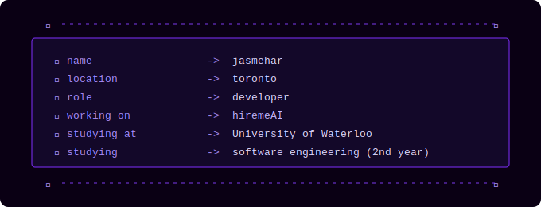

<!--
✦ · · · · ✦ · · · · ✦ · · · · ✦ · · · · ✦ · · · · ✦ · · · · ✦
         G I T H U B   P R O F I L E   README
✦ · · · · ✦ · · · · ✦ · · · · ✦ · · · · ✦ · · · · ✦ · · · · ✦
-->

<div align="center">

<!-- ══════════════════════════════════════════════════ -->
<!--           ANIMATED SVG HEADER w/ ROTATING PLANET  -->
<!-- ══════════════════════════════════════════════════ -->



<br/>

<!-- ✦ PIXEL FONT TYPING ANIMATION ✦ -->
<!--  -->

<!-- <br/> -->
<br/>

<!-- ✦ SOCIAL LINKS ✦ -->
[](https://linkedin.com/in/jasmehar-kaur)
[](https://jasmehar-k.github.io/)
[](mailto:jasmehar.kr@gmail.com)
<br/>


</div>

<br/>

---

<!-- ══════════════════════════════════════════════════ -->
<!--                   ABOUT ME                        -->
<!-- ══════════════════════════════════════════════════ -->

<div align="center">

### 🌙 &nbsp; `about me` &nbsp; 🌙

</div>

<br/>

<pre>
         
       ✦ · · · · · · · · · · · · · · · · · · · · · · ✦    
  ╔════════════════════════════════════════════════════════╗
  ║                                                        ║
  ║  ✦ name ->  jasmehar                                   ║
  ║  ✦ location -> toronto                                 ║
  ║  ✦ role -> developer                                   ║
  ║  ✦ studying at -> university of waterloo               ║
  ║  ✦ studying -> software engineering (2nd year)         ║
  ║  ✦ currently working on → <a href="https://github.com/jasmehar-k/pelican">pelican</a>                                  ║
  ║                                                        ║
  ╚════════════════════════════════════════════════════════╝
       ✦ · · · · · · · · · · · · · · · · · · · · · · ✦    

</pre>
<!--  -->


<!-- <div align="center">


</div> -->

<br/>

<!-- ✦ SECTION DIVIDER ✦ -->
<div align="center">

· · ✦ · · · · ✦ · · · · ✦ · · · · ✦ · · · · ✦ · · · · ✦ · · · · ✦ · · · · ✦ · · · · ✦ · ·


</div>

<!-- ══════════════════════════════════════════════════ -->
<!--                  TECH STACK                       -->
<!-- ══════════════════════════════════════════════════ -->
<div align="center">

### 🛸 &nbsp; `tech stack` &nbsp; 🛸

<br/>

**· · · languages · · ·**


**· · · frontend · · ·**


**· · · backend, systems & infra · · ·**


**· · · ai / ml & data · · ·**


**· · · tools & security · · ·**


</div>
<br/><!-- ✦ SECTION DIVIDER ✦ -->
<div align="center">

· · ✦ · · · · ✦ · · · · ✦ · · · · ✦ · · · · ✦ · · · · ✦ · · · · ✦ · · · · ✦ · · · · ✦ · ·


</div>

<!-- ══════════════════════════════════════════════════ -->
<!--                  GITHUB STATS                     -->
<!-- ══════════════════════════════════════════════════ -->

<div align="center">

### 🪐 &nbsp; `stats` &nbsp; 🪐

<br/>


<!--  -->

<br/><br/>


</div>

<br/>


<!-- ══════════════════════════════════════════════════ -->
<!--                  PROJECTS                         -->
<!-- ══════════════════════════════════════════════════ -->

<!-- <div align="center">

### 🌠 &nbsp; `projects in orbit` &nbsp; 🌠

<br/>


&nbsp;


</div> -->

<br/>

<!-- ✦ SECTION DIVIDER ✦ -->
 <div align="center">

· · ✦ · · · · ✦ · · · · ✦ · · · · ✦ · · · · ✦ · · · · ✦ · · · · ✦ · · · · ✦ · · · · ✦ · ·

</div> 

<!-- ══════════════════════════════════════════════════ -->
<!--               ACTIVITY GRAPH                      -->
<!-- ══════════════════════════════════════════════════ -->

<div align="center">

### ☽ &nbsp; `activity` &nbsp; ☾

<br/>

[](https://github.com/ashutosh00710/github-readme-activity-graph)

</div>

<br/>


<!-- ══════════════════════════════════════════════════ -->
<!--                   FUN FACTS                       -->
<!-- ══════════════════════════════════════════════════ -->

<!-- <div align="center">

### ⋆ &nbsp; `transmissions from the void` &nbsp; ⋆

</div>

<br/>

```
  ⋆ ·  01  · 
  ✦ ·  02  · 
  ⋆ ·  03  · 
  ✦ ·  04  · 
``` -->

<br/>

<!-- ══════════════════════════════════════════════════ -->
<!--                     FOOTER                        -->
<!-- ══════════════════════════════════════════════════ -->

<div align="center">

  · · · · · · · · · · · · · · · · · · · · · · · · · · · · · ·
          ✦  thanks for stopping by  ˚✧₊⁎  ✦
  · · · · · · · · · · · · · · · · · · · · · · · · · · · · · ·

<!-- Footer wave -->


</div>
